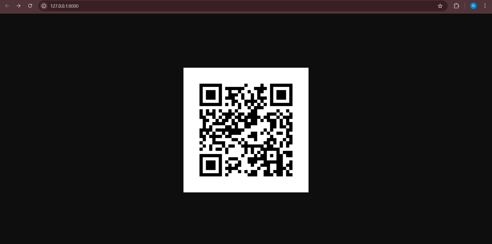
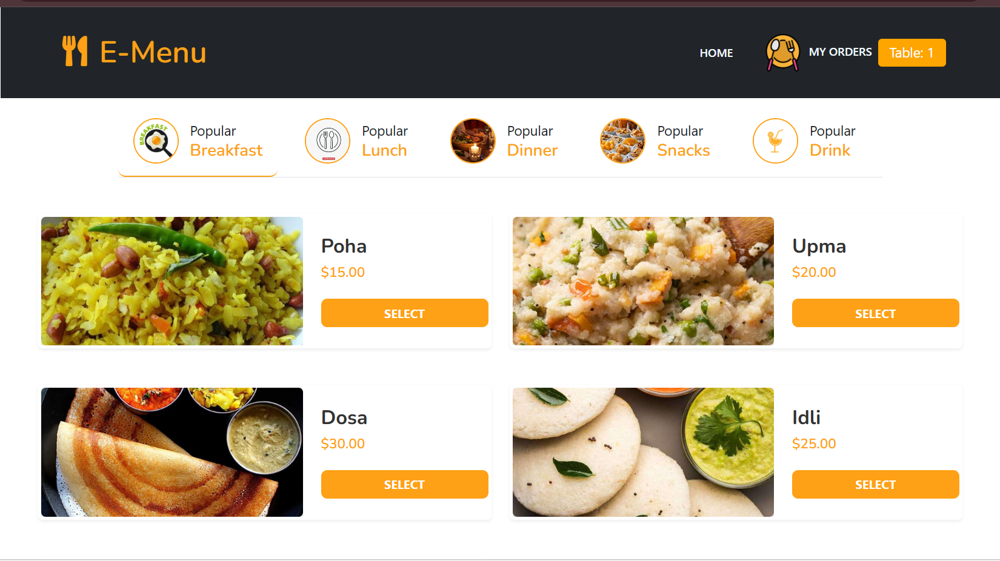
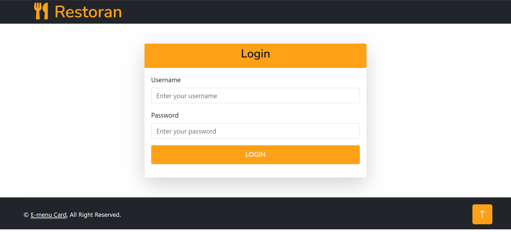
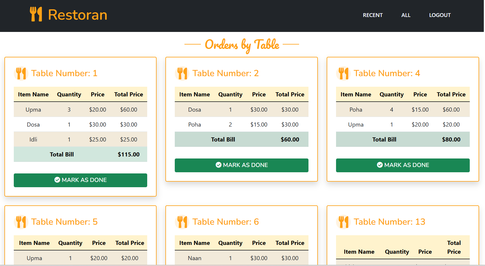

# 🍴 Mini Food Ordering System

The Mini Food Ordering System is a **web-based platform** designed to streamline restaurant operations. It allows **customers, kitchen staff, and counter staff** to manage orders and payments efficiently, reducing errors and improving workflow. Built with **Django, HTML, CSS, and SQLite**, it demonstrates role-based access and organized order management.

--


## 🚀 Features

- **Table User**
  - View digital menu
  - Place new orders
  - Track order status

- **Kitchen User**
  - Receive and manage orders
  - Update cooking progress
  - Notify when ready

- **Counter User**
  - Handle payments
  - Generate receipts
  - Monitor overall system

---

## 🛠️ Tech Stack

- **Backend**: Django  
- **Frontend**: HTML, CSS  
- **Database**: SQLite  

---
## 🚀 Methodology


## 📸 Screenshots

### 🍽️ Table User
 
  
  
    

### 👨‍🍳 Kitchen User
    

### 💰 Counter User
  
  

---

## ⚡ How to Run Locally

```bash
# Clone repo
git clone https://github.com/siddhidoiphode/mini-project.git
cd miniProject

# Create virtual environment
python -m venv venv
source venv/bin/activate   # On Windows: venv\Scripts\activate

# Install dependencies
pip install -r requirements.txt

# Apply migrations and start the server
python manage.py migrate
python manage.py runserver
```
Open [http://127.0.0.1:8000](http://127.0.0.1:8000) in your browser to use the app.

